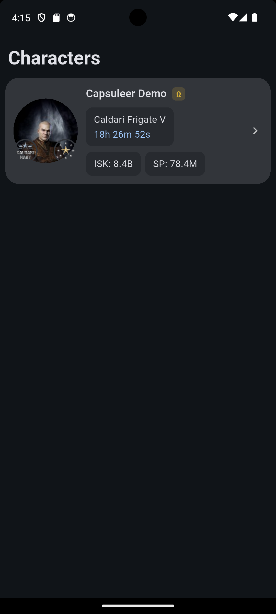
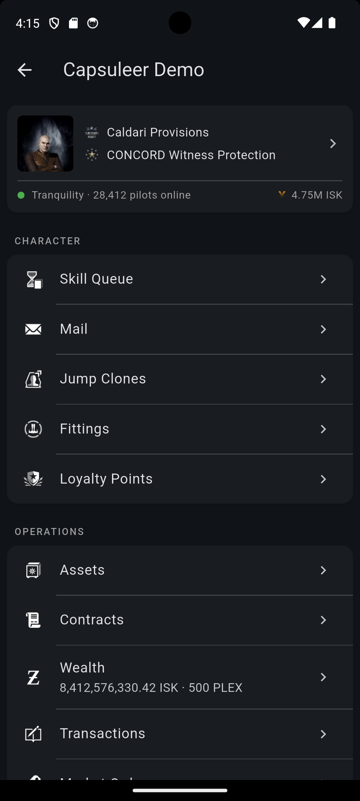

# NeoCompanion

Unofficial EVE Online companion app for iOS and Android. Built with Flutter against the current ESI.

Multi-character read-only dashboard: skills, wallet, assets, contracts, fittings, industry jobs, planetary colonies, mail and more — all behind EVE SSO.

| Characters | Character sheet |
|---|---|
|  |  |

> Screenshots taken in `DEMO_MODE` against seeded fixtures — see [Demo / screenshot mode](#demo--screenshot-mode).

## Features

### Characters
- Multi-account support — sign in with as many EVE characters as you like, switch between them with one tap
- Live character sheet: portrait, corp/alliance, security status, wallet balance, total SP, jump clones, implants, attributes
- Alpha / Omega badge inferred from the skill queue (no ESI endpoint exposes account state directly)
- Server status tile: TQ player count and current ESI compatibility window

### Skills
- Full skill queue with live countdowns and per-skill progress
- Local notifications fire the moment each queued skill finishes — works while the app is closed
- Browse the entire skill tree with trained / untrained filters and search

### Wallet
- Wallet journal with full transaction history, filterable by category
- Market transactions with running totals
- Active market orders (buy / sell) with sparkline price history from regional market data

### Assets
- Recursive container hierarchy — drill into ships, cans and citadel hangars
- Player-assigned ship/container names take precedence over type names
- Search across types and custom names; locations resolved through stations, structures and systems
- PLEX-in-station tracking (the account-wide PLEX Vault is not exposed by ESI)

### Industry & Planets
- Character industry jobs (manufacturing, research, invention, reactions) with end-time countdowns
- Planetary colonies overview, per-planet pin layout and extractor / factory schedules

### Fittings
- ESI-stored fits plus a local fitting editor with live capacitor, defense and DPS calculations
- Slot picker constrained by ship CPU / power-grid / rig size and module restrictions
- EFT import / export

### Contracts, Mail, Loyalty
- Character contracts with item lists and reward / collateral details
- EVEMail inbox with HTML body rendering
- Loyalty points across every NPC corp the character is enlisted with

### Item database
- Full local copy of CCP's Static Data Export normalized into SQLite
- Browse by market group, search by name, view dogma attributes, traits and required skills
- Updates run as a one-tap download when CCP publishes a new SDE build

## Production hardening

- EVE SSO with PKCE via flutter_appauth, JWT validation against the live JWKS
- Concurrent refresh-token requests are coalesced so EVE's rotation can't invalidate parallel calls
- ESI cache layer: ETag / If-None-Match for every GET, full respect for `X-ESI-Error-Limit-Remain` with exponential backoff on 420
- Refresh tokens stored in iOS Keychain / Android EncryptedSharedPreferences via flutter_secure_storage
- Cloud backup and device-to-device transfer of secure storage explicitly disabled
- Global uncaught-error sink ready to plug into Sentry / Crashlytics
- Release builds run R8 minify + shrinkResources with proguard rules; offline mode covered by a top-level connectivity banner

## Flavors

Two entry points share a single bootstrap:

- `lib/main_dev.dart` — development flavor
- `lib/main_prod.dart` — production flavor

Configuration is injected at build time via `--dart-define-from-file`. The real `config/dev.json` and `config/prod.json` files are gitignored; commit only the `*.example` templates.

| Variable | Required | Notes |
|---|---|---|
| `EVE_CLIENT_ID_DEV` | dev only | Client ID from developers.eveonline.com |
| `EVE_CLIENT_ID_PROD` | prod only | Client ID from developers.eveonline.com |
| `EVE_CALLBACK_SCHEME` | optional | Defaults to `eveauth-neocompanion` |
| `ESI_COMPATIBILITY_DATE` | optional | Pinned ESI compatibility date |
| `SENTRY_DSN` | optional | Crash reporting (sink not yet attached) |

## Setup

```bash
cp config/dev.json.example config/dev.json
# fill in EVE_CLIENT_ID_DEV with your developer client id
```

Register your application at https://developers.eveonline.com/ with redirect URI `eveauth-neocompanion://callback` and the scopes listed in `lib/core/auth/sso_scopes.dart`.

## Run

```bash
# Dev
flutter run -t lib/main_dev.dart --dart-define-from-file=config/dev.json

# Prod (debug-signed locally; release signing kicks in once android/key.properties exists)
flutter run -t lib/main_prod.dart --release \
  --dart-define-from-file=config/prod.json
```

## Release builds

### Android

Generate an upload keystore once and copy the template:

```bash
keytool -genkey -v -keystore ~/keystores/neocompanion-upload.jks \
  -keyalg RSA -keysize 2048 -validity 10000 -alias upload
cp android/key.properties.example android/key.properties
# fill in storeFile, storePassword, keyAlias, keyPassword
```

Then build the obfuscated app bundle with split debug symbols (don't lose the symbols folder — Play Console needs it to de-obfuscate stack traces):

```bash
flutter build appbundle -t lib/main_prod.dart \
  --dart-define-from-file=config/prod.json \
  --obfuscate --split-debug-info=build/symbols/android
```

### iOS

```bash
flutter build ipa -t lib/main_prod.dart \
  --dart-define-from-file=config/prod.json \
  --obfuscate --split-debug-info=build/symbols/ios
```

## Demo / screenshot mode

Run the app against seeded fixtures instead of real ESI — useful for
App Store / Play Store screenshots without exposing real characters,
and for App Review which has to exercise the app without an EVE account.

```bash
flutter run -t lib/main_dev.dart \
  --dart-define-from-file=config/dev.json \
  --dart-define=DEMO_MODE=true
```

In demo mode:
- A fictional `Capsuleer Demo` character is auto-loaded (no SSO flow)
- Character sheet, skill queue, wallet journal/transactions, market orders, assets and server status are populated from `lib/core/demo/demo_data.dart`
- The "Add Character" FAB and "Logout" action are hidden so taps can't reach real SSO
- Type icons and portraits still load from images.evetech.net (real CCP artwork, no account data)

To extend coverage to more screens, add overrides to `demoOverrides()` in `lib/core/demo/demo_overrides.dart`.

## Tests

```bash
flutter test
flutter analyze
```

## Architecture

- **Riverpod** for dependency injection and state. Providers live next to the feature they serve (`lib/features/<feature>/`); cross-cutting concerns (network, auth, types DB, notifications) live in `lib/core/`.
- **Dio** for HTTP, with a stack of interceptors handling auth, refresh, ETag caching and the ESI per-IP error window.
- **sqflite** for the local SDE and app database. The SDE is bulk-imported from a prebuilt bundle and updated through an explicit user action; on-demand `/universe/names/` is reserved for non-bulk lookups.
- **flutter_local_notifications** for skill-completion alarms, scheduled at exact `finish_date` per queue entry.
